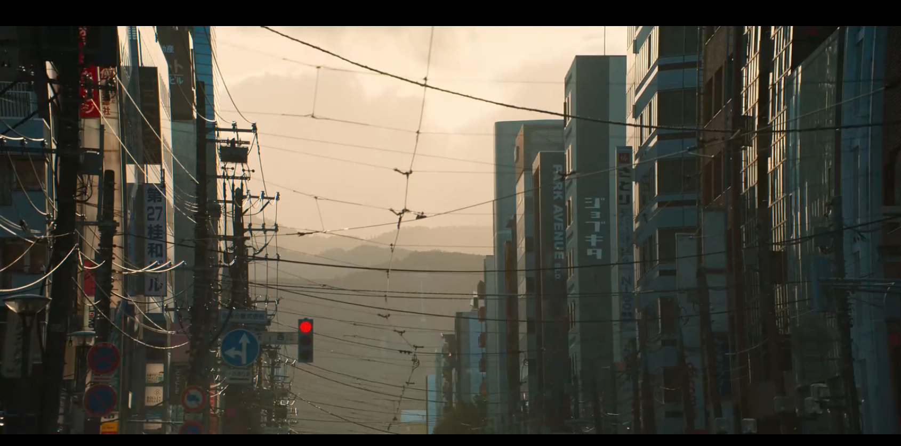
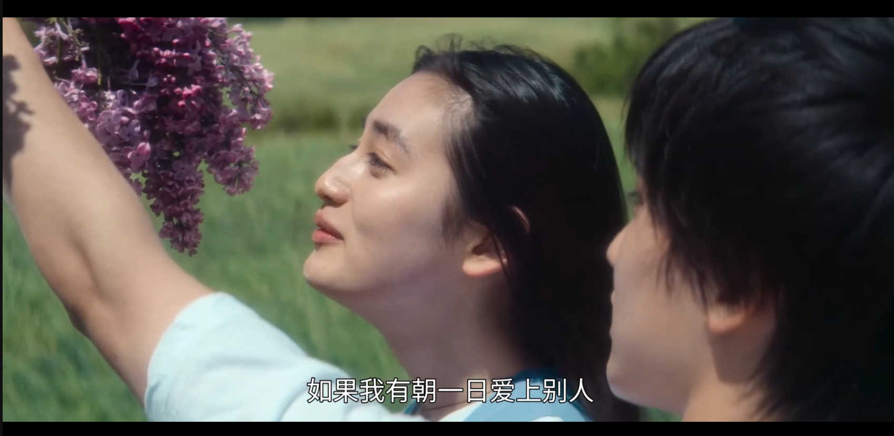
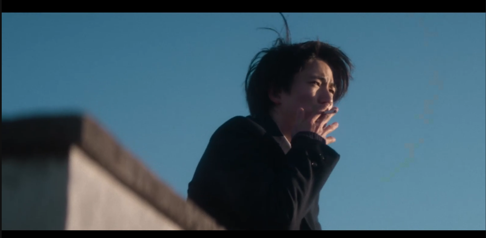
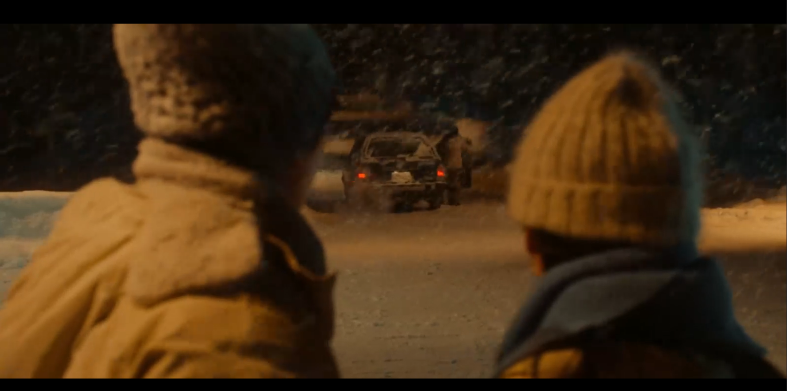
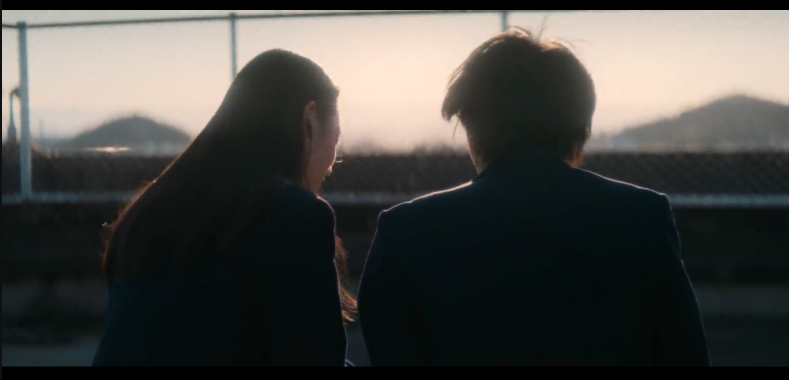
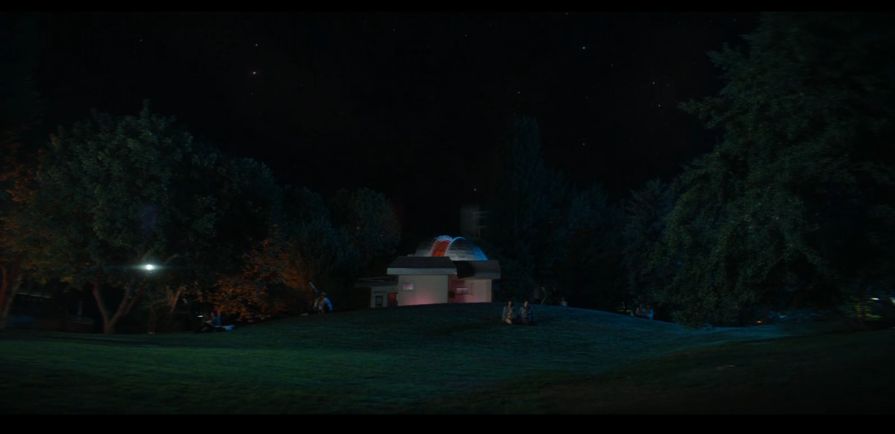
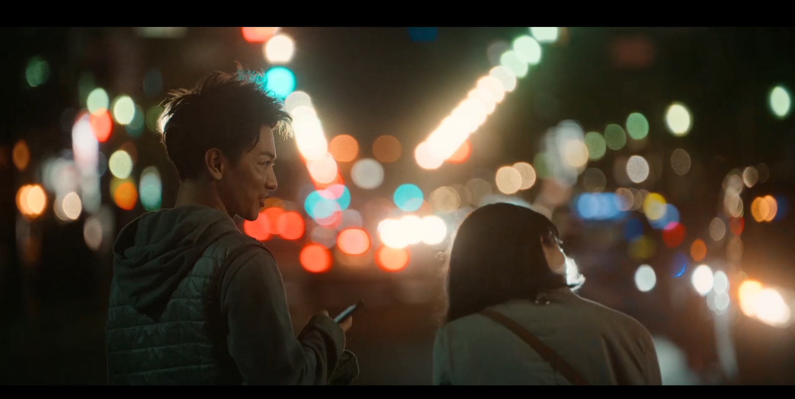
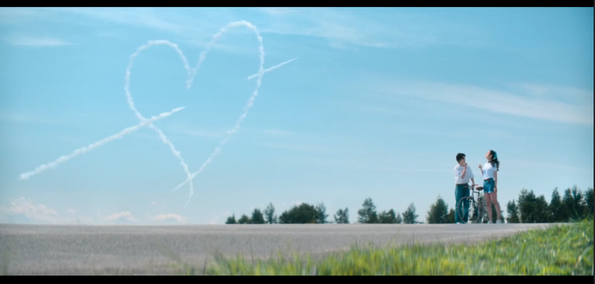
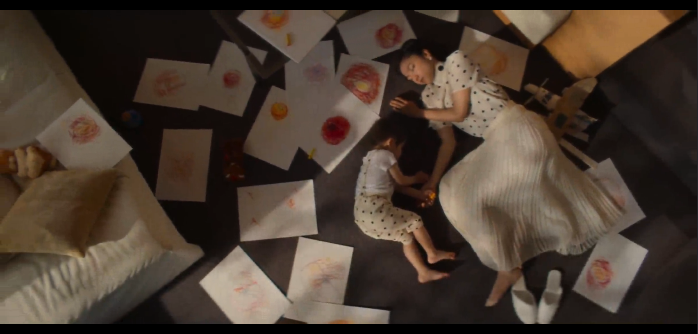
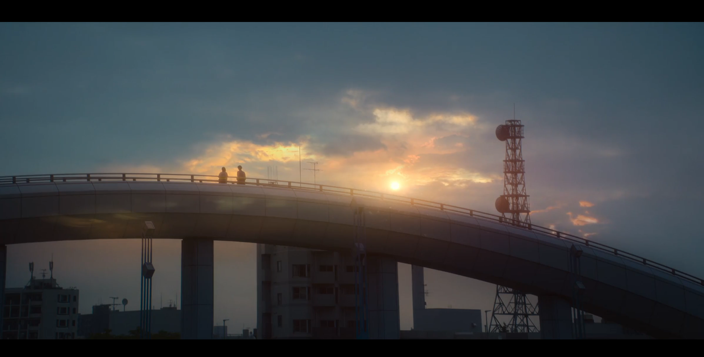

## **第一集**

Pic.1 近景为两侧的建筑物，画面中心是远处水墨画般的重山叠嶂，下方一抹红色格外醒目，交错的电线杂乱中提现城市的特点

Pic.2 很明显的长焦镜头，前景为红绿灯、指示牌，背景为浅色调的楼体与天空

典型的日系镜头，大量青蓝色留白，树叶作为模糊近景，有岩田俊介的风格，左右极不对称，但乍看没有失衡感。

## 第二集

## 第三集

## 第五集

## 第六集

### 第七集

## 第八集