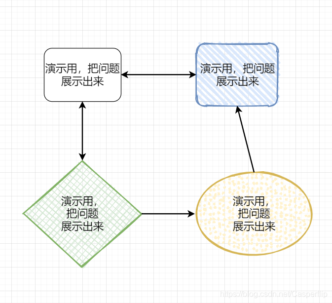
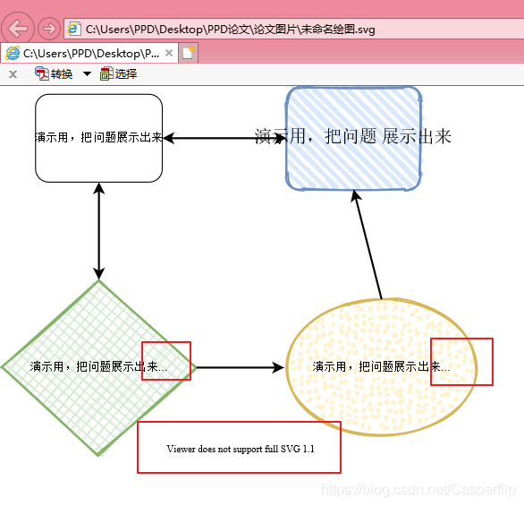
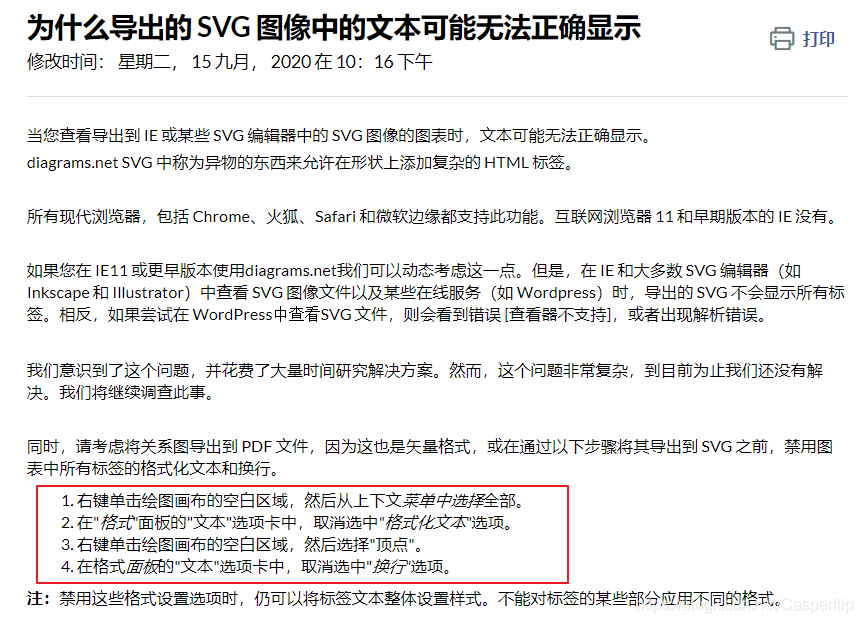
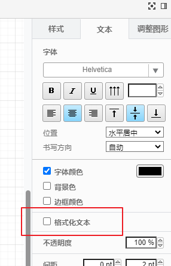
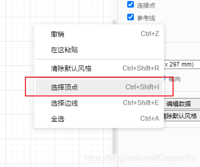
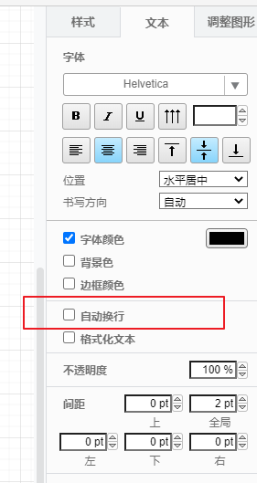

# 解决draw.io生成SVG[矢量图](https://so.csdn.net/so/search?q=矢量图&spm=1001.2101.3001.7020)导入Word显示有误的问题以及推荐几种SVG绘图方法

## 起因

最近因为要着手开始写论文了，寻觅了好久终于找到一款好用的画图工具：draw.io(现在已更名叫diagrams.net)。之所以用它而不用VISIO，是因为整体的操作细节上要比VISIO强很多，而且图库也更丰富美观。但是当我画好之后导出矢量图SVG文件插入Word的时候，总会有一部分内容被隐藏，而且最下面还会冒出一行英文小字，感觉很是恼火。而直接输出JPEG格式或者PNG格式可以保证图形的原样但是清晰度不够。（如下图所示）

图1 在drow.io里画出的图形完全没有问题

图2 当单独打开或者在Word中插入图片的时候就会发现，好好的字显示不完了，而且最下面还会出来一行英文提示！

## 解决办法

原来上图的那行英文是可以点击的，是个超链接网址：https://desk.draw.io/support/solutions/articles/16000042487
在这个网址上，说明了为什么会出现这些问题的原因，以及解决办法！

原文为英文，截图为Edge浏览器翻译的截图。只要按照图中红框的办法操作一遍，就可以得到想要额正确格式了！（如果不想读流程文字，可以直接看上面链接，里面附了操作动图）

## 操作步骤

1. Ctrl+A全选对象，然后在右侧将格式化文本的勾取消（此时你可能会发现你的一些字体字号发生变化，需要手动调整）
   
2. 在图中空白处右键，选择顶点
   
3. 将自动换行的勾取消
   
4. 手动调整你的图片到合适的效果，然后最后导出SVG格式图片，成功

————————————————
版权声明：本文为CSDN博主「Casperflip」的原创文章，遵循CC 4.0 BY-SA版权协议，转载请附上原文出处链接及本声明。
原文链接：https://blog.csdn.net/Casperflip/article/details/110129607